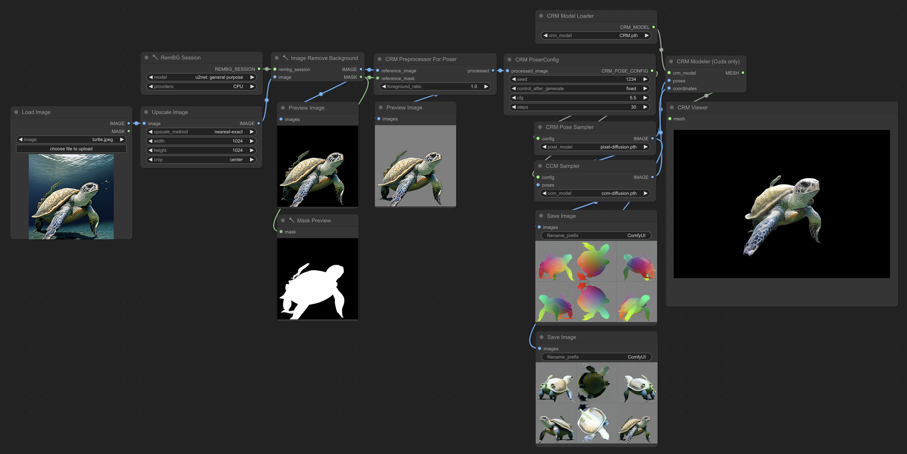

# ComfyUI-Flowty-CRM

This is a custom node that lets you use Convolutional Reconstruction Models right from ComfyUI.

[CRM](https://ml.cs.tsinghua.edu.cn/~zhengyi/CRM/) is a high-fidelity feed-forward single image-to-3D generative model. 



This node has been adapted from the [official implementation](https://github.com/thu-ml/CRM) with many improvements that make it easier to use and production ready:
* Added support for cpu generation (initially could only run on cuda)
* xformers is no longer required
* separation of the inference pipeline into 3 parts, which enables it to run on low vram gpus and gives users freedom to alter the inputs at any step
* automatic input image processing
* high speed and high quality outputs with materials in glb and obj formats
* closely integrated with comfyui's internal attention code
* cleaner code, with less dependencies and less memory usage

### Installation:
* Install ComfyUI
* Clone this repo into ```custom_nodes```:
  ```shell
  $ cd ComfyUI/custom_nodes
  $ git clone https://github.com/flowtyone/ComfyUI-Flowty-CRM.git
  ```
* Install dependencies:
  ```shell
  $ cd ComfyUI-Flowty-CRM
  $ pip install -r requirements.txt
  ```
  if using cuda, install cuda dependencies too:
  ```shell
  $ pip install -r requirements-cuda.txt
  ```
* [Download CRM models](https://huggingface.co/Zhengyi/CRM/tree/main) and place them in ```ComfyUI/models/checkpoints```
* Start ComfyUI (or restart)
* Use the example workflow ([cpu](workflow_rembg_crm.json) | [cuda](workflow_rembg_crm_cuda.json))
* Note: To run the example workflows you will also need to install [ComfyUI_essentials](https://github.com/cubiq/ComfyUI_essentials)


Acknowledgement:
* Researchers of CRM: [Zhengyi Wang](https://thuwzy.github.io/), Yikai Wang, Yifei Chen, Chendong Xiang,
Shuo Chen, Dajiang Yu, Chongxuan Li, Hang Su, Jun Zhu   
* three.js comfyui interface: [MrForExample](https://github.com/MrForExample/ComfyUI-3D-Pack)
* snr depth reconstruction: [Imagedream](https://github.com/bytedance/ImageDream) 

This is a community project from [flowt.ai](https://flowt.ai). If you like it, check us out!

<picture>
 <source media="(prefers-color-scheme: dark)" srcset="logo-dark.svg" height="50">
 <source media="(prefers-color-scheme: light)" srcset="logo.svg" height="50">
 
</picture>